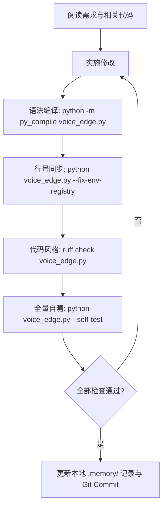

# AGENTS.md — Voice Edge AI Agent Guidelines

本文档为所有在此代码库上工作的 AI Agent 提供指引与约束规范。在对项目进行任何修改前，请务必完整阅读并严格遵守以下准则。

---

## 1. 项目架构概述

- **单文件核心**：核心业务逻辑集中于单个高内聚文件 `voice_edge.py`。
- **构建系统**：采用标准 `hatchling` 构建后端，Wheel 打包目标为 `voice_edge.py`。
- **命令行入口**：
  - MCP 模式：`uv run main`
  - HTTP 服务模式：`uv run main --http`
  - 简写别名：`ve`（`uv run ve`）
- **主要能力**：本地 MLX 模型推理、流式 Edge-TTS、faster-whisper / Apple Speech 转录、macOS 状态栏 HUD 与全局热键、小爱音箱桥接、OpenCode / OpenRouter / Browser 模型中继。

---

## 2. 核心铁律（强制执行）

### 铁律 1：每次修改必须通过 Ruff 检查（Linting）
- **要求**：任何对 Python 文件的修改，必须在最终交付前运行并通过 Ruff 静态检查，确保 **0 Error / 0 Warning**。
- **执行命令**：
  ```bash
  ruff check voice_edge.py
  # 或者全局检查
  ruff check .
  ```
- **配置规则**：遵循 `pyproject.toml` 中的 `[tool.ruff.lint]` 配置（包含 `E`, `F`, `B`, `ASYNC`, `RUF` 等规则）。不要随意修改该规则集或使用 `# noqa` 逃避校验。

---

### 铁律 2：修改代码后必须同步环境变量登记表（ENV REGISTRY）
- **机制**：`voice_edge.py` 顶部维护了一份 `环境变量登记表 (ENV REGISTRY)`，汇总了全局 197+ 个环境变量的默认值与定义代码行号。
- **要求**：只要在代码中增删行、重构函数或新增环境变量，必须运行自动修复命令以重新通过 AST 对齐登记表行号：
  ```bash
  python voice_edge.py --fix-env-registry
  # 或
  uv run main --fix-env-registry
  ```
- **输出确认**：确保看到输出 `ENV REGISTRY updated: ...` 或 `ENV REGISTRY already current: ...`。

---

### 铁律 3：必须通过全量自测试（Self-Test）
- **要求**：在交付或提交前，必须运行全量内置自测，确保全部测试用例 100% 通过。
- **执行命令**：
  ```bash
  python voice_edge.py --self-test
  # 或
  uv run main --self-test
  ```
- **基线要求**：当前基线为 **114/114 passed**。不得出现任何 `❌ Self-test failed`。

---

### 铁律 4：OpenCode 目录发现与缓存设计约束
OpenCode 动态发现与缓存机制具备严格的安全与防污染要求，修改相关逻辑时必须恪守：
1. **缓存版本隔离**：磁盘缓存仅使用版本化文件 `voice_edge_opencode_catalog_v2.json`，格式为：
   ```json
   {
     "version": 2,
     "endpoints": {
       "zen": { "valid": true, "models": { ... } },
       "go": { "valid": true, "models": { ... } }
     }
   }
   ```
2. **人工配置绝不入缓存**：
   - 远端探测循环的协议推断来源必须仅限于：`文档表格 (Doc) -> 磁盘缓存快照 (Cache) -> 内置基线 (Baseline)`。
   - 绝不允许在探测阶段读取 `OPENCODE_MODEL_OVERRIDES`。
   - 磁盘缓存写入必须发生在合并 `OPENCODE_EXTRA_MODELS` 和 `OPENCODE_MODEL_OVERRIDES` **之前**。
   - 缓存模型条目仅允许包含 `protocol` 和严格布尔值 `text_only`，绝不允许写入 `publish` 等人工字段。
3. **保留有效空快照**：
   - 远端成功返回合法空列表时，记录端点为 `valid: True, models: {}`。
   - 断网或失败时，优先恢复该有效空快照（0 个模型），绝不能误判为“获取失败”而回退 Baseline。
4. **严格布尔解析**：
   - 解析 `publish`、`text_only` 等布尔配置必须使用 `_parse_strict_bool()`，严禁依赖 Python 原生隐式真值转换（防止 `"false"` 被判为真）。

---

### 铁律 5：绝对禁止暂存或提交 `.memory/` 目录
- **要求**：`.memory/` 目录（包含每日记录及 `MEMORY.md` 长期记忆）仅用于本地 Agent 运行上下文与记忆维护。**绝对不要执行 `git add .memory/` 或将其提交到版本控制中（DO NOT stage or commit `.memory/`）**。

---

## 3. 标准开发与提交流程

在处理任何涉及代码修改的请求时，Agent 必须按顺序执行以下闭环：



1. **语法检查**：`python -m py_compile voice_edge.py`
2. **对齐行号**：`python voice_edge.py --fix-env-registry`
3. **代码检查**：`ruff check voice_edge.py`（必须 0 errors）
4. **自测验证**：`python voice_edge.py --self-test`（必须 114/114 通过）
5. **记忆同步**：在本地 `.memory/YYYY-MM-DD.md` 记录重大架构变更与决策背景
