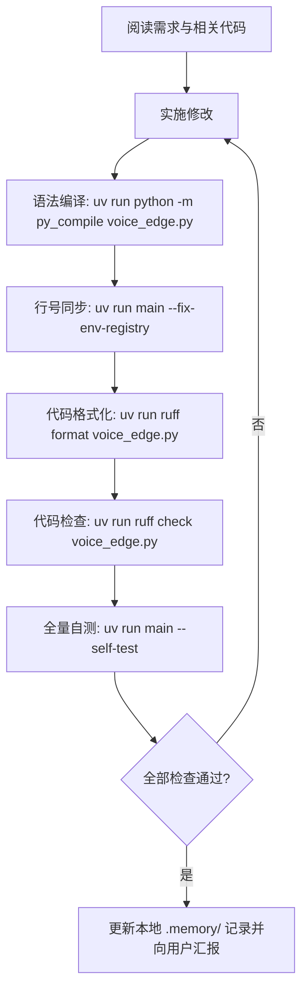

# AGENTS.md — Voice Edge AI Agent Guidelines

本文档为所有在此代码库上工作的 AI Agent 提供指引与约束规范。在对项目进行任何修改前，请务必完整阅读并严格遵守以下准则。

---

## 1. 项目架构概述

- **单文件核心**：核心业务逻辑集中于单个高内聚文件 `voice_edge.py`。
- **构建系统**：采用标准 `hatchling` 构建后端，Wheel 打包目标为 `voice_edge.py`。
- **命令行入口**：
  - MCP 模式：`uv run main`
  - HTTP 服务模式：`uv run main --http`
  - 简写别名：`ve`（`uv run ve`）
- **主要能力**：本地 MLX 模型推理、流式 Edge-TTS、faster-whisper / Apple Speech 转录、macOS 状态栏 HUD 与全局热键、小爱音箱桥接、OpenCode / OpenRouter / Browser 模型中继。

---

## 2. 核心铁律（强制执行）

### 铁律 1：代码必须经过 Ruff 格式化与静态检查（Format & Lint）
- **要求**：任何对 Python 文件的修改，必须在最终交付前运行并通过 Ruff 格式化与静态检查，确保风格统一且 **0 Error / 0 Warning**。
- **执行命令**：
  ```bash
  uv run ruff format voice_edge.py
  uv run ruff check voice_edge.py
  # 或者全局检查
  uv run ruff check .
  ```
- **配置规则**：遵循 `pyproject.toml` 中的 `[tool.ruff.lint]` 配置（包含 `E`, `F`, `B`, `ASYNC`, `RUF` 等规则）。不要随意修改该规则集或使用 `# noqa` 逃避校验。

---

### 铁律 2：修改代码后必须同步环境变量登记表（ENV REGISTRY）
- **机制**：`voice_edge.py` 顶部维护了一份 `环境变量登记表 (ENV REGISTRY)`，汇总了全局 197+ 个环境变量的默认值与定义代码行号。
- **要求**：只要在代码中增删行、重构函数或新增环境变量，必须运行自动修复命令以重新通过 AST 对齐登记表行号：
  ```bash
  uv run main --fix-env-registry
  ```
- **输出确认**：确保看到输出 `ENV REGISTRY updated: ...` 或 `ENV REGISTRY already current: ...`。

---

### 铁律 3：必须通过全量自测试（Self-Test）
- **要求**：在交付前，必须运行全量内置自测，确保全部测试用例 100% 通过。
- **执行命令**：
  ```bash
  uv run main --self-test
  ```
- **基线要求**：当前基线为 **129/129 passed**。不得出现任何 `❌ Self-test failed`。

---

### 铁律 4：严禁编写低价值或虚假测试（No Pseudo-Tests）
- **要求**：
  - 自测用例必须真实驱动实际生产执行链路（Real Execution Path），对核心业务逻辑具备实质性断言。
  - **严禁伪测试**：坚决禁止编写「即使把生产代码的核心修复逻辑删除，测试仍然能通过」的低价值虚假测试。
  - 严禁为了虚增测试数量而仅对静态数据结构做无意义断言，或者构造脱离生产运行状态的孤立 Mock。
  - **严禁真实外部路径**：测试代码（`--self-test` 与 `test/` 下 harness）中**不得出现真实主目录、仓库或模型路径**（如 `/Users/<name>/...`）。需要路径时用 `tempfile.mkdtemp()` 或虚构的绝对路径常量（如 `_SELFTEST_WORKSPACE = "/w/workspace"`）；真机 harness 用 `Path(__file__).resolve().parents[1]` 定位仓库，状态库与缓存写入临时目录。

---

### 铁律 5：严禁未经允许擅自改变 Git 文件状态（No Unauthorized Git Add / Stage / Unstage / Commit）
- **核心禁令**：AI Agent **绝对禁止**在没有得到用户明确许可的情况下执行任何改变 Git 暂存区（Index）或提交历史的命令：
  1. **严禁擅自 Unstage**：绝对禁止执行 `git restore --staged`、`git reset`、`git rm --cached` 等任何将用户已暂存（staged）文件取消暂存的操作！用户已暂存的内容由用户全权掌控，Agent 绝无权利触碰、撤销或改变其暂存状态。
  2. **严禁擅自 Stage / Commit**：绝对禁止未经用户明确许可自动执行 `git add`、`git stage` 或 `git commit`。
- **工作区规范**：Agent 自身的代码修改在完成验证（通过自测与 Ruff）后，保留在工作区中向用户汇报，等待用户指令。**严禁以「遵守未提交规则」为借口去擅自 unstage 用户已暂存的文件，严禁以任何理由改变任何文件的现有 Git 状态**。

---

### 铁律 6：绝对禁止暂存或提交 `.memory/` 目录
- **要求**：`.memory/` 目录（包含每日记录、长期记忆 `MEMORY.md` 以及各专项业务设计规范如 OpenCode 缓存机制等）仅用于本地 Agent 运行上下文维护。**绝对不要执行 `git add .memory/` 或将其提交到版本控制中（DO NOT stage or commit `.memory/`）**。

---

### 铁律 7：绝对禁止自行启动或关闭脚本
- **要求**：AI Agent **绝对禁止**在没有得到用户明确许可的情况下自动或停止 voice_edge.py 脚本。

---

### 铁律 8：注释不得引用外部文件，不得写外部文件的版本号，不得写日期
- **要求**：`voice_edge.py`（及任何脚本）的注释/docstring 中**绝对禁止**引用任何外部文件，包括但不限于：
  - 抓包文件；
  - 外部二进制/ bundle 路径；
  - 外部源码文件；
  - 二进制地址/偏移。
- **版本号禁令**：注释中**绝对禁止**出现外部文件的版本号。版本号只能作为**线上协议常量值**存在，不得写进任何注释文字。
- **日期禁令**：注释中**绝对禁止**出现日期。
- **允许的写法**：注释只描述协议本身（message 名、字段号、wire 形状、取值语义），出处一律写**不带文件、不带版本、不带日期**的表述。
- **理由**：外部文件会移动/删除/过期，注释引用它们会迅速腐烂成误导；版本号写进注释会在 app 升级后变成错误信息。协议事实（字段、取值）才是唯一需要沉淀在注释里的东西。

---

## 3. 标准开发与提交流程

在处理任何涉及代码修改的请求时，Agent 必须按顺序执行以下闭环：


```mermaid
flowchart TD
    A[阅读需求与相关代码] --> B[实施修改]
    B --> C[语法编译: uv run python -m py_compile voice_edge.py]
    C --> D[行号同步: uv run main --fix-env-registry]
    D --> E[代码格式化: uv run ruff format voice_edge.py]
    E --> F[代码检查: uv run ruff check voice_edge.py]
    F --> G[全量自测: uv run main --self-test]
    G --> H{全部检查通过?}
    H -- 否 --> B
    H -- 是 --> I[更新本地 .memory/ 记录并向用户汇报]
```

1. **语法检查**：`uv run python -m py_compile voice_edge.py`
2. **对齐行号**：`uv run main --fix-env-registry`
3. **代码格式化**：`uv run ruff format voice_edge.py`
4. **代码检查**：`uv run ruff check voice_edge.py`（必须 0 errors / 0 warnings）
5. **自测验证**：`uv run main --self-test`（必须 129/129 通过）
6. **记忆更新与汇报**：在本地 `.memory/YYYY-MM-DD.md` 记录重大架构变更与决策背景；保持所有修改严格处于**未暂存状态（unstaged）**，向用户清晰汇报改动细节，**严禁擅自执行 git add 或 git commit，等待用户指示与审查授权**。
